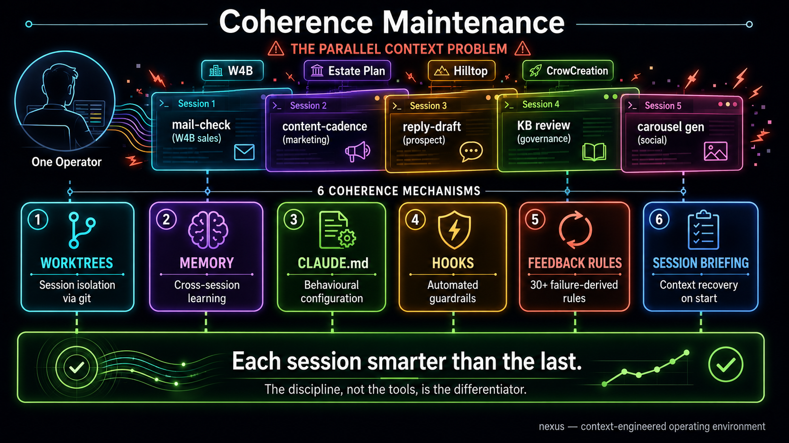
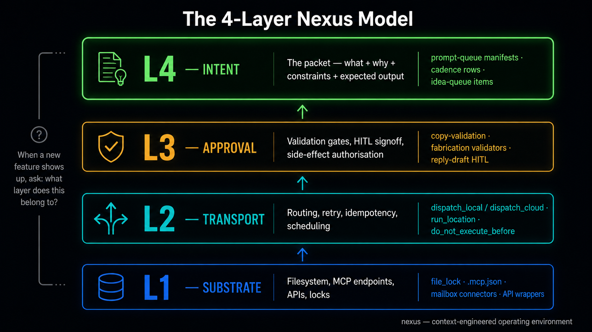
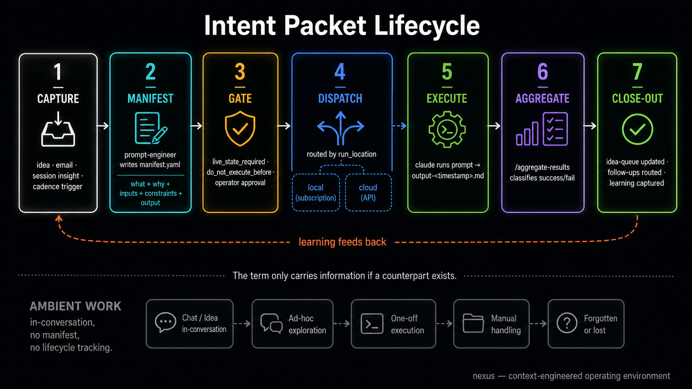

  

# The Coherence Problem

A field guide to AI coordination failure

> For the quick start, see the [main README](../README.md).
> For the plugin install, see [Install](../README.md#install).

---

## I. The week it stops working

You set up an AI coding assistant on a Monday. By Wednesday you've built
more in three days than you normally build in two weeks. You add a second
project. You start running sessions in parallel — one doing research while
another writes code. You connect a few automations. Everything accelerates.

Around week three, something shifts. Your AI suggests building a feature
you shipped last Tuesday. You find two automations doing overlapping work
because neither knew about the other. A session in the morning produces
a recommendation based on data that changed by afternoon — but the
afternoon session doesn't know that, and acts on the stale version anyway.

You fix these individually. They feel like one-off mistakes. You add more
context to your prompts. You paste in reminders. You keep a mental model
of which session knows what. For a while this holds.

By week five, the mental overhead of keeping everything coordinated has
quietly eaten the productivity gains. You're spending real time on
session management that used to be spent on actual work. Your AI is
individually excellent at every task you give it, but the tasks don't
know about each other. State leaks between sessions. Instructions from
one context contradict instructions from another. Automations run on
assumptions that were true when they were written and aren't anymore.

This isn't a tool problem. The models are good. The integrations work.
The individual sessions are often impressive. What's failing is the
space between them.

Most people hit this wall and do one of two things: scale back to
simpler usage, or add another tool on top, hoping it will be the one
that finally holds things together. Neither works, because the problem
isn't capability. The problem is coherence.

## II. What breaks (and what doesn't)

It helps to be precise about what isn't the problem.

The models are not the problem. The tools are not the problem. The
prompts are not the problem. You can improve all three and you should.
But better prompts help within a session. They don't help across
sessions, across days, or across the growing surface area of your
automations.

What breaks is the connective tissue.

The context that existed in your morning session and is gone by
afternoon. The instruction you wrote into one configuration file that
contradicts what you wrote into another three weeks later. The
automation that checks a data source that was restructured last
Tuesday. The five parallel sessions that each think they have the
current state, and none of them do, because you made a decision in
session two that sessions one, three, four, and five don't know about.

These failures have a specific shape. They're not crashes or errors.
They're quiet wrongness. The system keeps running. The outputs look
plausible. But they're built on foundations that have shifted without
anyone noticing.

Here's the part that doesn't match intuition: the failures get worse
as you get better. A beginner using one AI tool for one task doesn't
have coordination problems. An advanced user running parallel sessions
across multiple projects with accumulated automations and instructions
has coordination problems everywhere. Skill with AI tools creates the
conditions for AI coordination failure.

## III. The coherence problem

There is a specific property that working systems have and degrading
systems lose. It doesn't have a standard name in the AI tooling
discourse, so it gets described indirectly — "context issues," "my AI
forgot," "things got out of sync." These descriptions are accurate but
imprecise. They sound like different problems. They are the same problem.

The property is coherence: every component in the system operates on
accurate, current state, and the outputs of one component don't
contradict the inputs of another.

A coherent system doesn't need you to remember what you told it
yesterday. It doesn't require you to manually synchronize state between
sessions. When something changes in one place, the parts of the system
that depend on that information either update or know they're stale. You
can delegate work without checking whether the delegate is operating on
last week's version of reality.

This sounds like table stakes. It is, for a single session. One person,
one AI, one conversation — coherence is free. The model holds state for
the duration. Instructions persist. Context is shared. Everything works.

The trouble starts when you add a second session. Or a second day. Or
a second project. Or an automation that runs while you're not watching.
Each addition is individually fine. Collectively, they create a system
where no single component has a complete picture of the current state,
and no mechanism exists to detect when components have diverged.

This is the coherence problem: as AI-augmented workflows grow,
coherence degrades faster than capability improves.

You don't notice at first because each session is still good. The
model is still smart. The tools still work. The degradation is between
components, not within them. It shows up as subtle wrongness — a
recommendation that's slightly off because it's based on information
that was true two days ago. An automation that runs correctly on
incorrect inputs. A session that does excellent work toward a goal
you quietly abandoned in a different session last week.

And the instinct to fix it by adding more — more tools, more
integrations, more automation layers — makes it worse. Each new
component adds capability AND adds another surface where state can
go stale, instructions can go unread, and context can fragment. The
coordination load compounds while the capability grows linearly.

The pattern is familiar from distributed systems engineering: a
network of individually reliable nodes becomes unreliable at the
system level because consistency is expensive and partition tolerance
is hard. The AI tooling world is rediscovering this, one frustrated
operator at a time, without the benefit of the decades of vocabulary
that distributed systems built to talk about it.

The coherence problem is not a bug in any particular tool. It is an
emergent property of multi-session, multi-tool AI workflows that
nobody warned you about because the tools are marketed on what a
single session can do, not on what happens when sessions accumulate.

## IV. A taxonomy of drift

Coherence doesn't fail in one way. It fails in five, and they feed
each other.

**State staleness.** You act on information that was true when you last
checked and isn't anymore. A session drafts an email to a prospect
whose deal was closed yesterday in another session. An automation
generates a report from a data source that was restructured last week.
You write instructions referencing a file that's been moved. The
information was correct when it was cached. It's wrong now. Nothing
told you.

**Context fragmentation.** Knowledge that exists in one session never
reaches another. You solve a problem in the morning and hit the same
problem in the afternoon because the afternoon session doesn't know
about the morning. You write a rule in one configuration file and a
contradictory rule in another. You learn something important and it
lives in a conversation that expires when the session ends.

**Instruction decay.** Rules that were clear when written become
invisible over time. Not because they were deleted, but because they
were buried under newer rules, or contradicted by newer instructions,
or simply never loaded into the sessions that needed them. The
instructions exist. They just don't execute. A governance document
says one thing. The actual behavior does another. Nobody notices
because nobody re-reads governance documents until something breaks.

**Infrastructure duplication.** You build something that already
exists because you couldn't find it. Your system has a script for
checking API health, but a new session doesn't discover it and writes
another one. You have a workflow for processing emails, but when a
new use case arrives, a fresh approach is built from scratch because
the existing one wasn't visible. Over time, your system accumulates
overlapping tools that each solve the same problem slightly
differently, and diverge further with each update.

**Feedback loss.** You learn something from a failure but don't encode
it anywhere that survives. A session discovers that a particular API
returns stale data unless you add a cache-busting parameter. The fix
goes in. The lesson doesn't. Three months later, a different session
hits the same API, doesn't know about the parameter, and fails the
same way. The system paid the cost of the failure but didn't keep
the receipt.

These five modes aren't independent. State staleness causes bad
decisions, which create context fragmentation when the correction
only happens in one session, which leads to instruction decay when
the rule to prevent it gets written but not propagated, which
produces infrastructure duplication when someone builds a workaround
instead of finding the fix, which means the original lesson is lost
again. It's a cycle. Each mode makes the others more likely.

The useful thing about naming them separately is diagnosis. When
something goes wrong, you can point at which mode failed. That
changes the fix from "add more context" to something specific:
check live state before acting, propagate corrections across sessions,
audit instructions for contradictions, index existing tools, or
encode lessons durably.

---

  

## V. Why discipline beats tooling

When things start breaking, the instinct is to add something. A better
knowledge base. A smarter orchestration layer. A new integration that
promises to keep everything in sync. Another tool on top of the tools.

This makes the problem worse. Every new component adds coordination
surface area. The knowledge base needs to stay current. The
orchestration layer needs accurate configuration. The integration
needs to know about changes in the systems it connects. You've traded
one coherence problem for three.

The counter-intuitive move is to add constraints instead of
capabilities.

A rule that says "before acting on cached information, check the live
source" prevents an entire class of state-staleness failures. It's not
a feature. It's not a tool. It's a sentence in a configuration file
that every session reads on startup. It costs nothing to maintain.
It operates at the point of failure rather than trying to prevent
the conditions that lead to failure.

A validation gate that blocks publishing until the content passes a
fabrication check catches errors that no amount of prompt engineering
prevents, because the errors come from the model's confidence, not
from missing instructions. The gate doesn't make the model better. It
makes the system honest about the model's limitations.

A feedback loop that says "when this breaks, write down why, and
review the log weekly for patterns" converts individual failures into
durable improvements. After a hundred entries, you have a specific,
empirical map of how your system fails. After two hundred, the rules
derived from that map start preventing failures before they occur.
After three hundred, the system is meaningfully different from a fresh
install, and the difference is entirely in the accumulated discipline.

The gap between a fresh install and a production-grade operating
environment isn't features. It's the record of everything that went
wrong and the rules that prevent it from happening again.

This is hard to sell because it's not a product. You can't install
discipline. You can't download someone else's failure log and expect it
to help, because the failures are specific to your system, your
workflows, your particular combination of tools and projects and
integrations. The patterns transfer. The specific rules don't.

But the meta-pattern does: record failures, detect patterns, codify
preventive rules, enforce them where failures actually occur. That
sequence works regardless of stack, scale, or model. It's old
engineering applied to a domain that's been moving too fast to notice
it was missing.

## VI. A model for thinking about it

When something breaks, the first question is usually "what went wrong?"
A more useful question is "at what level did it go wrong?"

Most coherence failures are misdiagnosed because they're treated at the
wrong level of abstraction. A stale-data failure looks like a bad
recommendation, so you fix the recommendation. But the problem wasn't
the recommendation. It was the data layer not knowing it was stale.
An unauthorized side effect looks like a rogue automation, so you
restrict the automation. But the problem wasn't the automation. It
was the absence of an approval gate between intent and execution.

A simple four-layer model helps sort this out:

**Layer 1: Substrate.** File systems, APIs, database connections,
authentication, locks. Failures here are obvious: file not found,
connection refused, permission denied.

**Layer 2: Transport.** How work gets routed, retried, scheduled, and
deduplicated. Failures here are less obvious: a task runs twice because
there's no idempotency check. A scheduled job fires on stale inputs
because nothing validated them first. Work gets lost or duplicated.

**Layer 3: Approval.** Validation gates, compliance checks, human-in-
the-loop authorization. Failures here are subtle: content goes out with
fabricated statistics. An automation sends an email a human would have
stopped. The system did what it was told. It shouldn't have been told.

**Layer 4: Intent.** What you actually want done, and the constraints
around it. Failures here are invisible until you see the output: the
work was well-executed but pointed in the wrong direction. The inputs
were wrong. The constraints were missing. Success was never defined
clearly enough to distinguish it from failure.

You don't need to build these layers. The model is useful as a single
diagnostic question: when something breaks, which layer broke?

The answer changes the fix. A Layer 1 problem needs better
infrastructure. A Layer 2 problem needs better routing. A Layer 3
problem needs a gate that doesn't exist yet. A Layer 4 problem needs
clearer specification before work begins.

The model borrows from networking and systems architecture. Its value
here is that AI tooling doesn't have a standard way to talk about
these layers yet. Without the vocabulary, every failure gets treated
as a prompt engineering problem or a tool selection problem. Most of
them aren't.

---

  

## VII. The smallest unit of delegatable work

When you hand a task to an AI session, what exactly are you handing
over?

In most workflows, the answer is: a natural language instruction and
access to everything. "Check my email and draft replies." "Review this
codebase and suggest improvements." "Update the CRM based on today's
calls." The instruction is vague. The scope is ambient. The AI figures
it out.

This works remarkably well for simple tasks. It falls apart for
complex systems, and the failure mode is coherence. When the scope is
"everything," you can't tell what the session actually looked at, what
it assumed, what it skipped, and what it changed. When something goes
wrong, you don't know where to look. The session read forty files,
made decisions about which ones mattered, and acted on those decisions.
Debugging this means reconstructing the session's reasoning, which is
gone the moment the session ends.

The fix is to make the unit of delegation explicit. Before a task
runs, it declares four things:

**What it needs.** Not "access to the codebase" but "the contents of
these three files and the output of this API call." Specific inputs,
named in advance.

**What it produces.** Not "improvements" but "a modified version of
this file, or a written explanation of why no modification is needed."
A concrete expected output that you can verify.

**What it must not do.** Not assumed boundaries but explicit ones.
"Do not modify files outside this directory. Do not make API calls.
Do not create new files without approval." Constraints that are
checkable, not just hoped-for.

**What counts as failure.** Not "something went wrong" but "if the
input file doesn't exist, stop and report rather than improvising.
If the API returns an error, stop and report rather than using cached
data." Defined abort conditions that prevent silent degradation.

This pattern goes by different names in different contexts. In
contract-based programming, it's preconditions and postconditions. In
distributed systems, it's message schemas. In project management, it's
a definition of done. The specific name matters less than the
discipline: specify before executing.

The benefit is diagnosability. When a task with explicit boundaries
fails, you know which boundary was violated. Was the input wrong? The
output unexpected? Did it exceed its constraints? Did it hit an abort
condition? Each answer points to a different fix. Compare this to
"the AI did something weird" as a failure report.

This isn't about reducing what AI can do. It's about making what AI
does visible. An AI with ambient access that produces good results is
indistinguishable from an AI with ambient access that produces
plausible-looking wrong results. Explicit boundaries are what let you
tell the difference.

---

  

## VIII. The flywheel (or: how discipline compounds)

Here is what a failure log looks like after a year of daily operation
across three businesses, five hundred AI sessions, and ninety-two
commands:

Three hundred and fourteen entries. Each one records what broke, why
it broke, what category it falls into, how many times it's happened
before, and what rule would prevent it next time.

The first fifty entries are scattered. Random failures, one-off
mistakes, things that went wrong for the first time. No patterns yet.

By entry one hundred, patterns emerge. The same root cause appears
in different disguises. "Acted on stale data" shows up as a bad email
draft, a wrong API call, a contradictory recommendation, and a wasted
automation run. Four different incidents, one underlying failure mode.

By entry two hundred, the rules derived from those patterns are
preventing failures before they happen. A pre-flight check catches
stale state. A validation gate blocks fabricated content. A branch
verification step prevents committing to the wrong codebase. These
aren't clever features. They're direct translations of past failures
into future prevention.

By entry three hundred, the system is qualitatively different from a
fresh install. Not because of the tools. The tools are the same. The
difference is in what the system knows about itself. Which API
endpoints return stale data. Which workflows have race conditions.
Which types of content need human review. Which automations break
when upstream formats change. This knowledge isn't in the model's
training data. It's not in any documentation. It's specific to this
system, earned through operation, and it compounds.

The flywheel works like this: failures get recorded. Records get
reviewed for patterns. Patterns become rules. Rules prevent future
failures. Prevented failures free up attention for harder problems.
Harder problems produce new failure modes. New failures get recorded.

Each rotation makes the system slightly more resilient. The gains
are small per cycle and large over time.

This is not automatic. The log doesn't review itself. The patterns
don't detect themselves. The rules don't write themselves. Someone
has to look at the entries, notice the clusters, write the rules, and
wire them into the system. It's work. It's unglamorous work. It
produces no visible features, no impressive demos, no shareable
screenshots. It just makes things stop breaking.

A system that prevents its own failure modes gets more reliable
without adding complexity. A system that adds features to compensate
for its failure modes gets more complex without getting more reliable.
Discipline reduces surface area. Capability expands it.

---

  

## IX. What this is and what it isn't

The patterns described in this guide come from a specific system called
Nexus. It is a single-operator system built on Claude Code and Obsidian,
running three parallel businesses over the course of a year. One person.
Ninety-two commands. Forty-plus scripts. Three hundred and fourteen
recorded failure patterns. Five hundred sessions and counting.

It is not a product. There is no installer, no hosted version, no
pricing page, no sales team. There are no plans for any of these things.

It is not a framework. You cannot and should not try to adopt it
wholesale. The specific commands, scripts, and configurations are
tailored to one operator's businesses, tools, and working style.
Transplanting them would be like copying someone else's filing system
and expecting it to make sense.

What it is: evidence that the coherence problem is solvable through
operational discipline, at least at single-operator scale. The proof
is in the failure log. The system breaks less now than it did six
months ago, not because the tools improved, but because the rules
accumulated.

What transfers: the patterns, not the implementation. The 4-layer
diagnostic model. The explicit-boundaries approach to delegation.
The failure-log-to-rule pipeline. The principle that discipline
compounds. You could build these on a different stack, in a different
domain, with different tools. The patterns would survive the port.
The scripts wouldn't, and aren't meant to.

## X. Patterns you can steal

Five patterns that work regardless of stack. Each one is something you
can start Monday morning with nothing more than a text file.

> Individual pattern files with implementation details are in the [`/patterns`](../patterns/) directory.

**1. The failure log.** Create an append-only file. Every time
something goes wrong in your AI workflows, add an entry: date, what
happened, why it happened, what category it falls into. Don't filter.
Don't fix. Just record. Review it weekly. After a month, you'll see
clusters. After three months, the clusters will tell you exactly
where your system is weak.

**2. The three-occurrence rule.** When the same failure appears three
times, stop treating it as a user error and start treating it as a
system bug. Three occurrences means the conditions that produce this
failure are structural, not accidental. Write a rule, a check, or a
gate that prevents the fourth occurrence. If you can't prevent it,
make it visible so you catch it faster next time.

**3. The live-state check.** Before any action that depends on
external state, query the source. Don't trust your notes. Don't
trust your memory. Don't trust what the system told you yesterday.
Check now. This one rule, applied consistently, prevents the single
most common coherence failure: acting on information that used to be
true.

**4. The narrow contract.** Before delegating a task to an AI session,
write down four things: what inputs it needs, what output you expect,
what it must not do, and what should make it stop and ask. This takes
sixty seconds. It saves hours of debugging when the session does
something unexpected, because you can point at exactly which
boundary was violated.

**5. The session pre-flight.** At the start of every AI session, verify
three things: what branch or context you're working in, what changed
since the last session, and whether any assumptions from the last
session are still valid. This prevents the most disorienting coherence
failure: doing excellent work in the wrong context.

## XI. Following the work

The system behind these patterns is built in the open. The failure log
is real. The rules are in production. The work continues daily.

If you're dealing with the same problems, the repo is here:
[github.com/crowcreation/nexus](https://github.com/crowcreation/nexus)

If you want to share your own coordination failures or see what others
are finding, the Discussions are open:
[Discussions](https://github.com/crowcreation/nexus/discussions)

---

[Principles](../PRINCIPLES.md) · [Patterns](../patterns/) · [Templates](../templates/) · [Back to README](../README.md)

## License

[MIT](../LICENSE)
