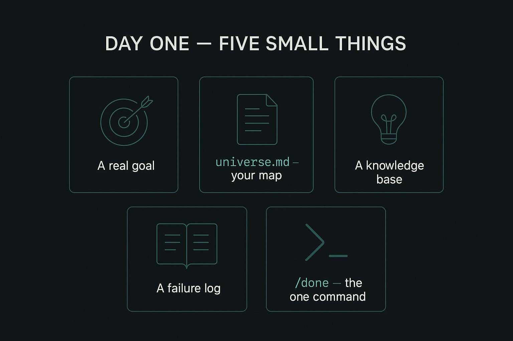

# Your First Hour

**What Nexus is, in one line:** a way to run your work with AI out of plain text files that you own, so the AI keeps track of what is going on instead of losing the thread. Over time you grow it into something that can run a fleet of agents for you. [Why This Exists](./01-why-and-vision.md) tells the fuller story. This page just gets you started.

Day one is deliberately small. You are not installing ninety commands or wiring up a fleet of agents. You set up five small things and learn one command.

## The five tiny day-one things

1. **A real business goal.** In `KB/Goals/`, write down the actual outcome you want for your business: win ten clients, ship the product, hit a revenue number. Pick a real one. Do not make "set up Nexus" your goal, because Nexus is the tool, not the point. Everything else here serves the real goal.

   *Goal versus universe, because this trips people up:* the goal (above) is the one thing you are driving at. The `universe.md` map (next) is everything around it, so the AI has the context to actually help. The goal is the destination; the universe is the map of the terrain.

2. **A living `universe.md`.** A short map of your world: your repositories, the sites you run, the tools you use, the projects you are on. It starts as a rough sketch and stays alive by being nudged as things change. It is a map, not a duplicate of everything you know.

3. **A knowledge base that grows through use.** A light folder structure, mostly empty at the start. You never bulk-fill it. It fills one useful page at a time, as you work. Stale knowledge is worse than absent knowledge.

4. **A failure log.** An append-only file. When something goes wrong in your AI work, you write one line: what happened, and your best guess at the root cause. This is the single habit that compounds the most.

5. **The `/done` command.** This is the one command you run on day one. At the end of a session, `/done` takes two minutes to capture what happened, log anything that broke, and nudge your map if the world changed. It is the forcing function that keeps the rest alive.

## How to actually set this up

Day one is not done by hand. The setup prompt interviews you, then builds the folders, the goal, the map, the failure log, and the commands for you. You answer a handful of questions and it builds the structure around your real work.

**What you need first:** Git installed, a GitHub account, and Claude Code (or a similar AI tool that runs in your terminal). That is the lot. You work in plain text files, so there is nothing new to learn to read or write them.

**Connect it to GitHub (once).** Your work lives in a Git repository, and GitHub is where it is backed up and version-controlled. After the setup prompt finishes:

1. Sign in once: run `gh auth login` and follow the prompts (pick GitHub.com, HTTPS, and log in through the browser). This is the step people skip.
2. Then create and push the repo: `gh repo create <name> --private --source=. --push`.

If a push fails with `permission denied` or a message about an SSH key, that is the sign-in step above not done yet, not a problem with your work. Run `gh auth login` first, then try again. If you are stuck, just tell Claude "I got permission denied pushing to GitHub, help me set up auth" and it will walk you through it.

## Why so small

The point of day one is not to be impressive. On day one your system is reading a one-day-old knowledge base, so it is modest, and that is expected. The experiment is what it becomes by month three, once it has read ninety days of your decisions, failures, and goals. That depends on a weekly habit, not on cleverness at setup time.

## Where to go next

- For the why behind all of this, read [Why This Exists](./01-why-and-vision.md).
- For the habits that make it compound, read [The Disciplines](./04-the-disciplines.md).

---

→ Template: [universe.md](../templates/universe.md)
→ Template: [CLAUDE-lite.md](../templates/CLAUDE-lite.md)

**Next:** [01 · Why This Exists](./01-why-and-vision.md)
