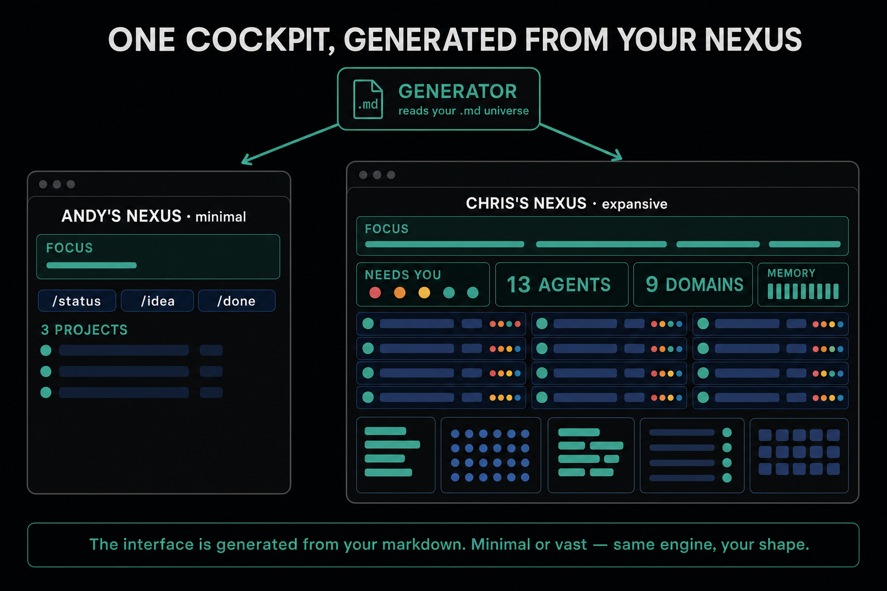

# Why This Exists

## The week it stops working

You set up an AI coding assistant. By Wednesday you have built more in three days than you normally build in two weeks. You add a second project. You start running sessions in parallel. Everything accelerates.

Around week three, something shifts. Your AI suggests building a feature you shipped last Tuesday. Two automations turn out to be doing overlapping work, because neither knew about the other. A morning session makes a recommendation based on data that changed by the afternoon, and the afternoon session acts on the stale version anyway.

You fix these one at a time. They feel like one-off mistakes. By week five, the mental overhead of keeping everything coordinated has quietly eaten the productivity gains. Your AI is excellent at every individual task, but the tasks do not know about each other.

This is not a tool problem. The models are good. The integrations work. What is failing is the space between them.

## The coherence problem

The property that working systems have and degrading systems lose is coherence: every part of the system operates on accurate, current state, and the output of one part does not contradict the input of another.

For a single conversation, coherence is free. The trouble starts when you add a second session, a second day, a second project, or an automation that runs while you are not watching. Each addition is individually fine. Together they create a system where no single part has the full picture, and nothing detects when the parts have drifted apart.

The counter-intuitive part: the failures get worse as you get better. A beginner using one tool for one task has no coordination problems. An advanced operator running parallel sessions across projects has them everywhere. Skill with AI tools creates the conditions for AI coordination failure.

## The vision

Picture a network of nexus points. Each point is one operator running a fleet of AI agents doing real operations inside their own universe. The interface to that universe is generated from your own markdown: minimal for a brand new operator, vast for someone years in, but the same engine and your own shape every time. The longer-term endgame is connecting those points so they can collaborate on projects.

That is the destination, not the day-one ask. The full picture lives in [The Arc](./06-the-arc.md). It is here only to show you what you are walking towards.

## AI operatives on the front line

The honest framing is this: you are an operator on the front line of working with AI, and the failures you hit are the scar tissue and the journey. You record them, you learn from them, and you share them as field reports. The progress is real and earned, not claimed.

## Markdown is a deliberate choice

Your relationship with AI is personal, and you should own it: you, not the corporations. That is why the substrate is plain markdown in a repository you control. Transparent, portable, no lock-in. The next module explains why this matters before any tooling does.

---

→ Full field guide: [The Coherence Problem](../docs/the-coherence-problem.md)
→ Principles: [twelve lines](../PRINCIPLES.md)

**Next:** [02 · The Substrate](./02-the-substrate.md)
