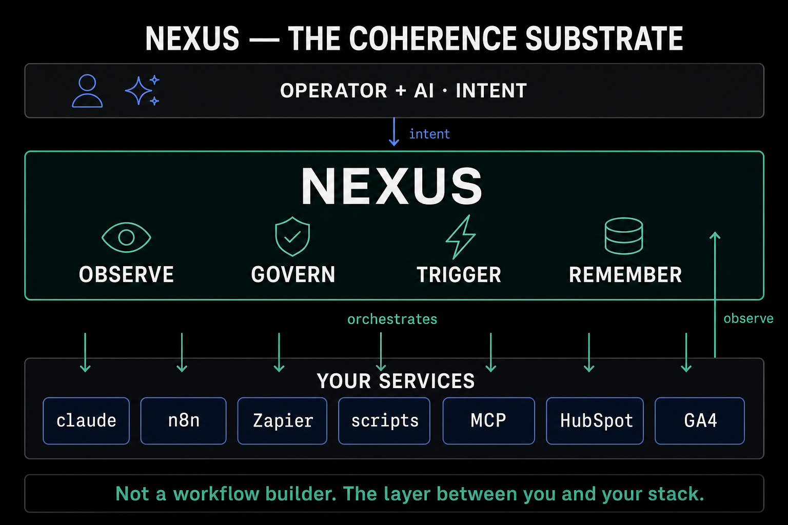

# The Substrate: Own Your Data

Before any clever tooling, there is the substrate: the ground everything else stands on. Get this right and the rest has somewhere stable to grow. Get it wrong and no amount of tooling on top will hold.

## What the substrate is

The substrate is the operational environment where persistent state lives. In practice that means a small, boring, durable set of things:

- **Git.** Version control, branches, and commit history as an audit trail. Without it, you cannot see what drifted.
- **Markdown.** A format that both you and the AI can read and write without friction. Plain text, no proprietary format, no special viewer needed.
- **A terminal and local-first tooling.** Search, editing, and scripting that work without depending on someone else's network.
- **A persistent AI environment.** Claude Code, Cursor, Aider, or similar, where instructions carry between conversations.

Nexus does not provide the substrate. It assumes it. These tools exist independently, they predate this project, and they will outlast it.

## Why it has to come first

The coherence problem only emerges when state is persistent. Without persistent state, there is nothing to drift. Without version control, you cannot track the drift. Without markdown, you do not have a format that humans and AI can both work with directly.

So the substrate is not an optional layer you add later. It is the precondition for everything else being worth doing.

## Own your data

Here is the core belief, stated plainly: your relationship with AI is personal, and you should own it. You, not the corporations whose tools you happen to be using this year.

Plain markdown in a git repository you control gives you three things that matter:

- **Transparency.** You can read every file. Nothing is hidden in a database you cannot inspect.
- **Portability.** Your knowledge, your rules, and your failure log move with you. They are not locked to one model or one vendor.
- **No lock-in.** When the tooling changes, and it will, your operating memory stays yours.

Vendors ship features. They cannot ship your habits, your accumulated rules, or your record of what broke. Those stay with you, in markdown, under git.

## Stand on the shoulders of giants

A guiding principle sits underneath all of this: build on existing infrastructure, do not reinvent it. Git already solved version control. Claude and similar tools already solved the intelligence. You ride that wave rather than rebuilding it. The work is in the discipline and the memory you layer on top, not in re-solving problems that mature engineering already solved.

---

→ Full guide: [The Operator Stack](../docs/the-operator-stack.md)
→ Principles: [twelve lines](../PRINCIPLES.md)
