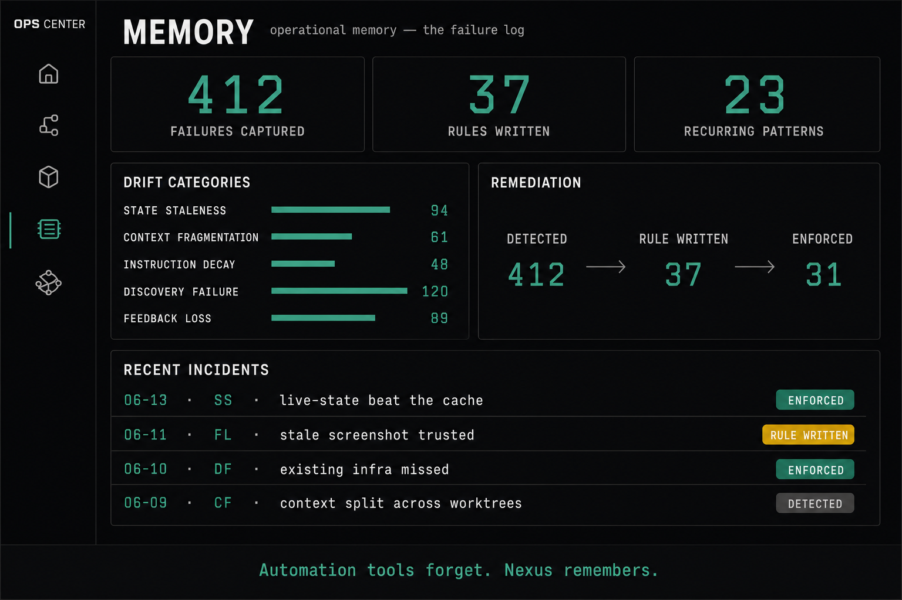

# The KB and Your Universe

Two things hold your operating memory: a knowledge base that grows through use, and a living map called `universe.md`. They are related but not the same thing, and the difference matters.

## What `universe.md` is

`universe.md` is a map of your world. It lists your repositories, the sites you operate, the tools and services you use, the projects you are working on, and optionally your goals and your working rhythm. It gives your AI a single place to understand the shape of what you do.

It is a map, not a duplicate. Early on, when your knowledge base is nearly empty, the map is close to the whole of what your AI knows about you. Later, once the knowledge base is full, the map becomes a thin index that points into it rather than repeating it.

## Why it has to stay living

A map that is filled in once and never touched again solves the wrong problem. It looks tidy and goes stale quietly, which is the exact failure this whole system exists to prevent.

So `universe.md` is kept alive through a simple lifecycle:

- **Seeded at setup.** The setup interview produces a first rough version.
- **Nudged by `/done`.** When a session actually changes your world, by adding a tool or starting a project, the close-of-session ritual offers to update the map. Not every session, only when the world moved.
- **Reconciled in the weekly review.** This is the main mechanism. Once a week you tidy the map against reality. This matches the pace at which it tends to drift.
- **Flagged by `/status`.** When you have the `/status` command later, it can point out drift, but it never writes to the map itself.

## How the knowledge base grows

The knowledge base is where durable knowledge lives: a decision and the reason behind it, a gotcha that took effort to work out, a how-to, a configuration that was fiddly to get right.

The one rule is that it grows through use and is never pre-filled. You do not bulk-import documents on day one. You add a page when a session produces something worth keeping, and the close ritual offers to capture it. Most sessions produce nothing durable, and that is fine. Stale knowledge is worse than absent knowledge.

A light convention keeps it usable: one topic per file, plain markdown, a short summary at the top with details below, and related pages linked liberally. There is no heavy structure to learn on day one.

## How the daily note and weekly review keep it alive

Each session close appends a short daily note: what you did, and anything left half-finished. These accumulate into a quiet record of the work.

The weekly review is where the map and the knowledge base get tended together: reconcile the map, tidy each project's current state and next step, and turn anything you explained to your AI twice this week into a single proper knowledge page. The system gives back what you put in, with interest.

## A light convention, Obsidian-friendly

The frontmatter is deliberately light: four fields on every note and overview, no more. `title`, `status`, `tags`, and `updated`. A fuller schema is a graduation step, not a day-one cost.

Because everything is plain markdown in folders, the knowledge base opens cleanly as an [Obsidian](https://obsidian.md) vault. Link related pages with vault-relative paths (for example `/KB/Knowledge/some-topic.md`), and a minimal setup with the `obsidian-git` and `dataview` community plugins gives you version-controlled notes and live queries over your frontmatter without leaving markdown.

---

→ Template: [universe.md](../templates/universe.md)
→ Full guide: [The Operator Stack](../docs/the-operator-stack.md)

**Next:** [04 · The Disciplines](./04-the-disciplines.md)
