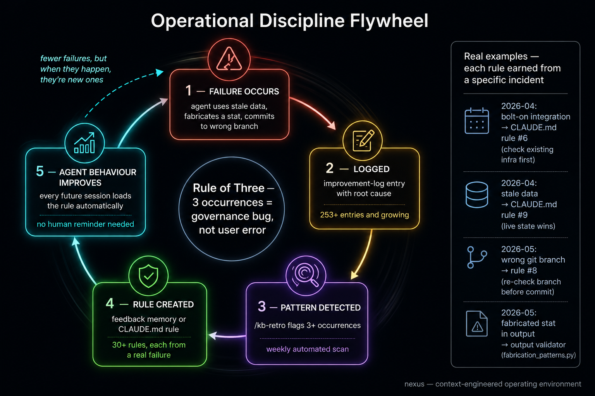

# The Disciplines

The whole system rests on a single idea: discipline beats tooling. You cannot install discipline and you cannot download someone else's. But the habits are simple, and they are what make the system compound.

## The failure log: scar tissue is the journey

The failure log is an append-only file. Every time something goes wrong in your AI work, you add one plain-English line: what happened, and your best guess at the root cause. You do not filter, you do not fix inline, you just record.

The temptation is to skip the entries that feel minor or embarrassing. Resist it. The minor failures are where the patterns hide. A wrong recommendation, a wasted run, a stale assumption: each one alone is forgettable, but three together are a signal.

If you keep only one habit, keep this one. It is the smallest unit of the system that compounds. It is your operational memory, and it is the scar tissue that records the journey.

## The session ritual

A session has a shape, and the shape is what keeps work coherent.

- **Pre-flight, at the start.** Before any work, verify three things: what context you are in, such as which branch and project; what changed since the last session; and whether your previous assumptions still hold. This takes about a minute and it prevents the most disorienting failure of all, which is doing excellent work in the wrong context.
- **Work, in the middle.** And before any action that depends on outside state, check the live source rather than your memory or your notes. When two sources disagree, the live one wins.
- **`/done`, at the close.** Two minutes to capture what happened, log anything that broke, and update your map if the world changed.

## The three-occurrence rule

One occurrence is an accident. Two is a coincidence. Three means the conditions that produce the failure are structural, and no amount of being careful will prevent the fourth.

So when the same root cause shows up three times, you stop treating it as a user error and start treating it as a system bug. You write a rule, a check, or a gate that prevents the next one. Count by root cause, not by surface symptom: a bad email draft and a wrong API call can be the same underlying failure wearing different clothes.

## The weekly review

The weekly review is a named discipline in its own right, the one that turns daily capture into compounding. Once a week, set aside about an hour. Read the failure log and count entries by root cause. If any cause has hit three, write one prevention rule. Tidy each project's current state and next step. Reconcile `universe.md` against reality. Turn anything you explained twice into a proper knowledge page. Then ask what the week should be.

The contract is blunt: the system gives back what you put in, with interest. Skipping the weekly review does not pause the experiment, it ends it.

## The cohort, which is the deal

When you are working as a cohort, the weekly review carries one more habit: a weekly meet where operators compare failure logs and share field reports. The weekly review is explicitly part of the cohort deal, not just a solo chore. That comparison is the deal, the way trust is built through observation. The next module covers it.

---

→ Pattern: [The Failure Log](../patterns/failure-log.md)
→ Pattern: [The Session Pre-flight](../patterns/session-pre-flight.md)
→ Pattern: [The Three-Occurrence Rule](../patterns/three-occurrence-rule.md)

**Next:** [05 · Working Together](./05-working-together.md)
