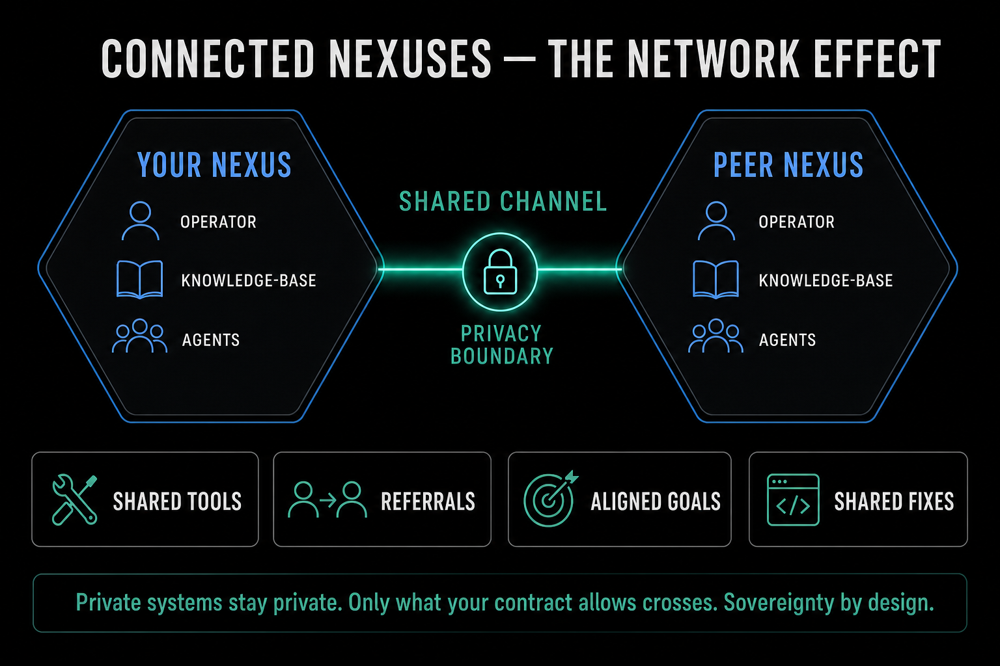

# Working Together

Each operator builds their own nexus point on their own real business. You are not joining a shared system, you are standing up your own. But operators do not work in isolation. The way they connect starts with people and markdown, long before any technical agent-to-agent link.

## Field reports

A field report is what you share outward from your own failure log. You take an entry, or a synthesis of several, redact anything project-specific or private, and post it where other operators can read it. The redaction happens before anything is generated, and nothing is ever sent automatically: the deliberate act of pasting is the consent.

This is how the front-line framing turns into something useful for others. Your scar tissue, anonymised and shared, becomes a pattern someone else recognises before they hit it themselves.

## The cohort deal

When two or more operators run nexus points alongside each other, the core habit is a weekly compare. Both operators bring their failure logs to a call and walk through them: what broke this week, what rule got written, what pattern the other should watch for.

That comparison is the deal. It builds trust through observation rather than through claims, and it is where shared learning actually happens. Version one of a connected network is not clever infrastructure, it is two people comparing notes once a week.

## Why the failure log is the channel

Because every nexus point uses the same plain entry shape, date, what happened, and root cause in plain English, failure logs are comparable across operators with no infrastructure at all. No shared database, no integration, no setup. The common shape is the entire connection layer for now.

There is no imposed taxonomy. Each operator's categories emerge from their own entries over time, mirroring their own workflows. Comparing how two operators' categories diverge, and where they happen to map onto each other, is itself part of the experiment.

## Connect through the human layer first

The instinct is to wire systems together early. The discipline is to resist that. Connect early, but through the human and markdown layer: the weekly compare and the shared field reports. The deeper technical connection, where agents exchange work directly, comes later, once each operator has felt the solo value first.

This ordering protects the most important thing, which is that you build and understand your own system before you link it to anyone else's. The full destination, including what connected points eventually make possible, is in the next module.

---

→ Command: [field-report](../commands/field-report.md)
→ Full guide: [The Operator Stack](../docs/the-operator-stack.md)
