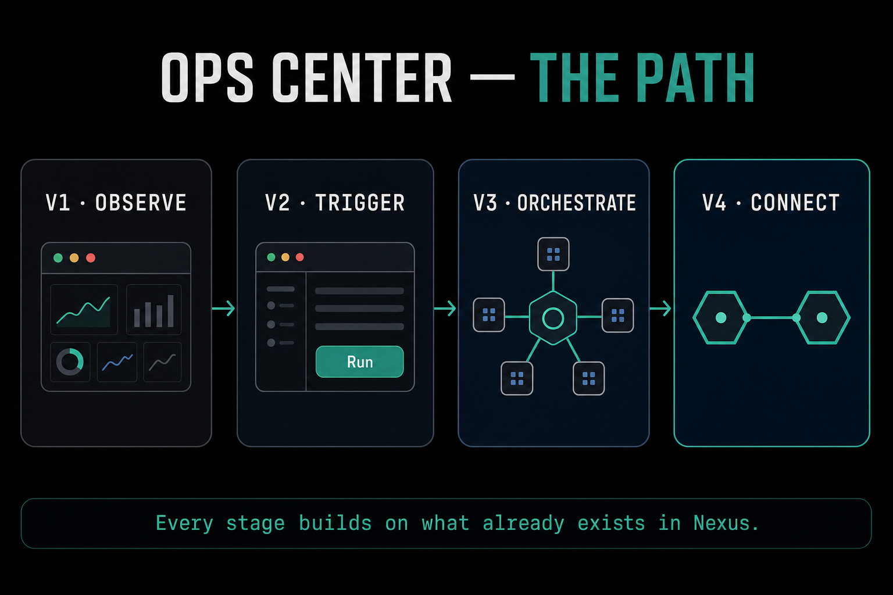

# The Arc: Where This Goes

Everything so far has kept day one tiny on purpose: a goal, a living map, a knowledge base, a failure log, and the `/done` command. This module is the opposite. It shows the whole arc, the destination you are walking towards. None of it is the day-one ask. Each milestone is pulled in later by real need, usually signalled by your own failure log, not by working through a checklist.

## The graduation milestones

**More of the session shape.** Day one ships `/done`. As the rhythm becomes habit, `/status` joins it at the start of a session to scan everything and recommend what to focus on, and `/idea` joins it in the middle to capture a thought without losing it. These arrive when the daily ritual has earned them, not before.

**Narrow-agent contracts.** Before you hand a task to an agent, you write down four things: what it needs, what it produces, what it must not do, and what counts as failure. This takes about a minute and it makes what the agent does visible, so that when something goes wrong you know exactly which boundary was crossed. The contract is the unit that makes agents safe to delegate to.

**Your first agent.** With a contract in hand, you build a narrow agent for a bounded, repeating job. Not a general assistant, a specific operative with a clear remit. This is where the fleet starts, one well-scoped agent at a time.

**The cockpit.** As your universe grows, an operations interface can be generated from your markdown. It is minimal for a new operator and vast for an experienced one, but it is the same engine reading the same files, shaped to you. It is a view onto the universe you already own, not a new system to maintain.

**Worktrees.** When your failure log starts showing parallel-session pain, where two sessions collide on the same working tree, session isolation through worktrees becomes worth setting up. This is a good example of the principle: it is pulled in by a real signal in your own log, not adopted on day one because someone else needed it.

**Connecting nexus points.** The far end of the arc is connecting operators so their agents collaborate on projects directly. As the previous module covered, this starts through the human and markdown layer and only later becomes a technical link. The network is the thing only connected operators get, and it is the endgame of the vision.

## The point of showing the arc

Two things are true at once. The destination is genuinely ambitious: a fleet of agents running off your own knowledge base, and eventually a network of operators collaborating across their universes. And day one is genuinely tiny: one goal, one map, one log, one command.

The arc is not a plan you execute top to bottom. It is a direction. Each piece earns its place when your real work, and your real failures, call for it. That is the whole discipline: the system grows through use, and it grows to mirror your own model of your world, not anyone else's.

---

→ Pattern: [The Narrow Contract](../patterns/narrow-contract.md)
→ Full guide: [The Operator Stack](../docs/the-operator-stack.md)
→ Full field guide: [The Coherence Problem](../docs/the-coherence-problem.md)
